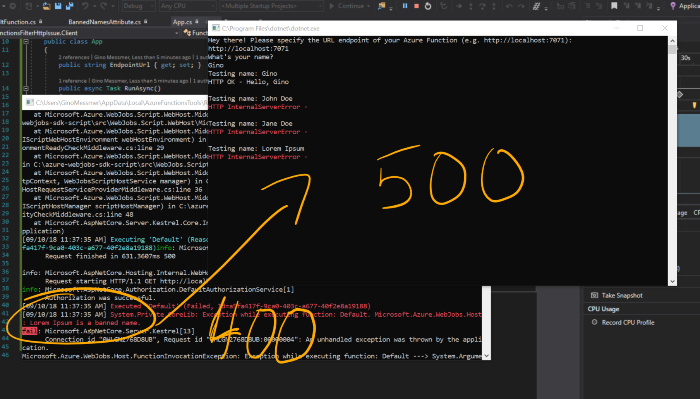

## What is this all about?

The current Azure Functions runtime provides a way to run certain checks before the actual function is being executed. This allows us to use it in specific scenarios like authorization, request filtering, validation and so on.

These checks are known as Filters, a well known concept adopted from ASP.NET. Filters are being built as attributes. Filters can be triggered by HTTP request or any other Function triggers, making them universal to use.

Though it’s possible to stop the execution from a filter, there’s no way to respond to a HTTP request and tell what exactly happened other than just providing an Internal Server Error (500) as HTTP response by default. This is the scope of this repository.

## The issue

If you take a look into `FunctionsFilterHttpIssue.Filter.BannedNameAttribute`, you’ll notice it throws an ArgumentException when ever the client passes a banned name (that is part of the BannedNames array). If we were about to translate it into common HTTP terms, that would be a 400 - Bad Request, right?

However, there’s no way for us to pass any status codes back to the runtime. The runtime interprets all exceptions in our Function as 500 - Internal Server Error, though that’s not entirely right in this case. It’s just an invalid request.

_**Expected behavior**: Pass HTTP 400 back to the client as response plus return the exception message to the response content_
_**Actual behavior**: Pass HTTP 500 back to the client as response, the response content is completely empty_

---

### More references

There are already several threads on GitHub, MSDN, StackOverflow covering the exact same issue, though they haven’t been addressed yet:

- https://github.com/Azure/azure-webjobs-sdk/issues/1314
- https://social.msdn.microsoft.com/Forums/en-US/ec9b73d7-b380-46af-b98a-1370c2b8242a